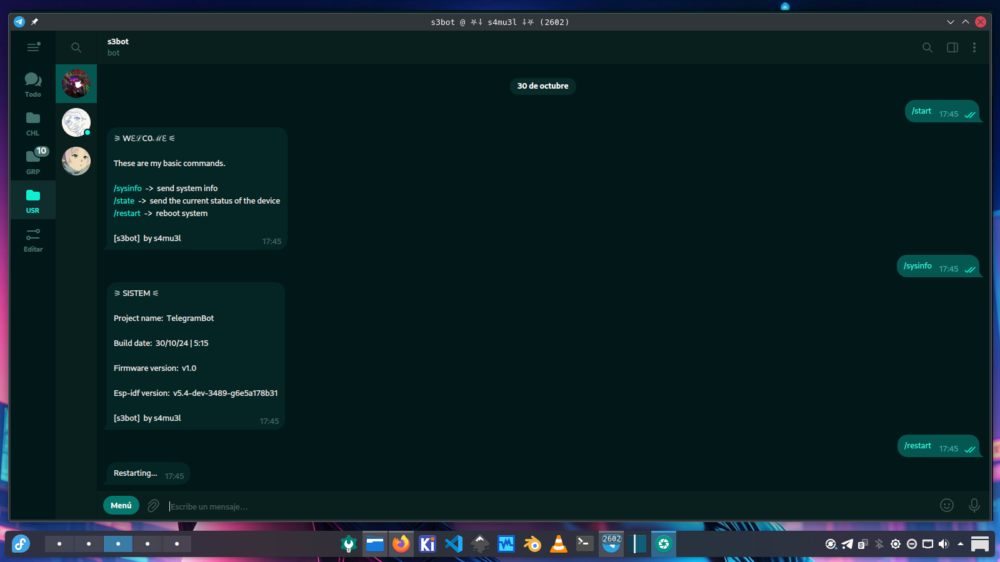

# esp32_telegrambot

This is an example of a bot using esp_http_client and the Telegram Bot API.

based on -> https://github.com/espressif/esp-idf/blob/master/examples/protocols/esp_http_client/main/esp_http_client_example.c

IDF version -> 5.4

Target -> Esp32s3

